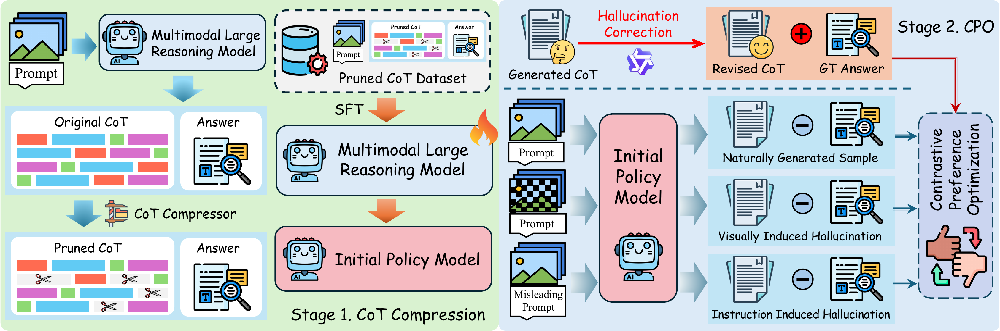

# MLRM_Understanding_Mitigating_Hallucination
[NeurIPS-2026] Multimodal Reasoning Models, Hallucination Mitigation, Contrastive Preference Optimization

[[Paper]](https://arxiv.org/abs/2602.03380)

[Hao Fang†](https://scholar.google.cz/citations?user=12237G0AAAAJ&hl=zh-CN),
[Jinyu Li†](https://scholar.google.com/citations?user=iY0gUyQAAAAJ&hl=zh-CN),
[Jiawei Kong](https://scholar.google.cz/citations?user=enfcklIAAAAJ&hl=zh-CN),
[Tianqu Zhuang](https://github.com/ZhuangQu),
[Kuofeng Gao](https://scholar.google.com/citations?user=0hVZ0woAAAAJ&hl=zh-CN&authuser=1),
[Bin Chen#](https://github.com/BinChen2021),
[Shu-Tao Xia](https://www.sigs.tsinghua.edu.cn/xst/main.htm)  



## Overview

Multimodal large reasoning models can produce correct answers while relying on hallucinated intermediate reasoning. This repository provides the training pipeline for **C3PO**, which combines chain-of-thought compression with contrastive preference optimization to reduce hallucinations in multimodal reasoning.

## Repository Structure

```text
.
├── figures/                  # README assets
├── src/
│   ├── C3PO/                 # Data generation and C3PO training
│   ├── data_processing/      # Dataset indexing
│   ├── sft/                  # Reference-model SFT
│   └── tokenskip/            # Chain-of-thought compression
├── .gitignore
├── README.md
└── requirements.txt
```

## Setup

The code was developed with Python 3.11.13 and CUDA-enabled GPUs.

```bash
conda create -n c3po python=3.11 -y
conda activate c3po
pip install -r requirements.txt
```

The Qwen3-VL server used while constructing preference data is best run in a separate environment:

```bash
conda create -n c3po-evaluator python=3.11 -y
conda activate c3po-evaluator
pip install -U vllm
pip install qwen-vl-utils==0.0.14
```

Place the required models under the following paths, or replace the paths in the commands below:

```text
./model/llmlingua_model
./model/evaluator/Qwen3-VL-30B-A3B-Instruct
./model/target_models/<MODEL_NAME>
```

The experiments use R1-Onevision-7B, Orsta-7B, MM-Eureka-7B, MM-R1-7B, and ThinkLite-VL-7B as target models.

Download the training dataset:

```bash
huggingface-cli download openbmb/RLAIF-V-Dataset \
  --repo-type dataset \
  --local-dir ./data/raw/RLAIF-V-Dataset \
  --local-dir-use-symlinks False
```

## Training

The commands below use MM-Eureka-7B as an example. Run them from the repository root.

### 1. Index the dataset

```bash
python -m src.data_processing.index_dataset \
  --dataset_root ./data/raw/RLAIF-V-Dataset \
  --output ./data/index.jsonl \
  --images_dir ./data/images
```

### 2. Generate the original chain-of-thought data

```bash
python -m src.C3PO.generate_origin_data \
  --index ./data/index.jsonl \
  --target_model ./model/target_models/MM-Eureka-7B \
  --output ./outputs/sft_datasets/original_cot_data.json \
  --num_samples 20000 \
  --seed 42 \
  --batch_size 512 \
  --tensor_parallel_size 4
```

### 3. Construct the SFT data

```bash
python -m src.C3PO.generate_sft_data \
  --sft_dataset ./outputs/sft_datasets/original_cot_data.json \
  --index ./data/index.jsonl \
  --output_dir ./outputs/sft_datasets \
  --compression_ratios 0.9 \
  --llmlingua_model ./model/llmlingua_model
```

### 4. Start the Qwen3-VL server

Run the following command in the `c3po-evaluator` environment:

```bash
python -m vllm.entrypoints.openai.api_server \
  --model ./model/evaluator/Qwen3-VL-30B-A3B-Instruct \
  --trust-remote-code \
  --dtype bfloat16 \
  --tensor-parallel-size 4 \
  --enable-expert-parallel \
  --mm-encoder-tp-mode data \
  --limit-mm-per-prompt '{"video": 0}' \
  --gpu-memory-utilization 0.75 \
  --max-model-len 8192 \
  --port 8001 \
  --allowed-local-media-path ./data
```

### 5. Construct the base preference data

Return to the `c3po` environment and keep the Qwen3-VL server running:

```bash
python -m src.C3PO.generate_base_dpo_data \
  --sft_dataset ./outputs/sft_datasets/original_cot_data.json \
  --index ./data/index.jsonl \
  --image_folder . \
  --model_name ./model/evaluator/Qwen3-VL-30B-A3B-Instruct \
  --api_base http://localhost:8001/v1 \
  --output_dir ./outputs/dpo_datasets \
  --compression_ratios 0.9 \
  --llmlingua_model ./model/llmlingua_model \
  --batch_size 128
```

### 6. Train the reference model

```bash
accelerate launch \
  --num_processes=4 \
  --mixed_precision=bf16 \
  -m src.sft.train_sft \
  --base_model_path ./model/target_models/MM-Eureka-7B \
  --data_path ./outputs/sft_datasets/sft_training_data_ratio_0.9.json \
  --image_folder . \
  --output_dir ./outputs/models/ref_sft \
  --lora_rank 8 \
  --lora_alpha 16 \
  --lora_dropout 0.0 \
  --num_epochs 2 \
  --batch_size 4 \
  --gradient_accumulation_steps 16 \
  --learning_rate 5e-5 \
  --warmup_ratio 0.1 \
  --gradient_checkpointing
```

### 7. Generate normal negatives

```bash
python -m src.C3PO.generate_normal_negatives \
  --input_path ./outputs/dpo_datasets/origin_dpo_training_data_ratio_0.9.json \
  --base_model_path ./model/target_models/MM-Eureka-7B \
  --ref_lora_path ./outputs/models/ref_sft/final_model \
  --image_folder . \
  --output_path ./outputs/dpo_datasets/c3po_normal_negatives_ratio_0.9.json \
  --batch_size 64
```

### 8. Generate hallucination negatives

Prompt-based negatives:

```bash
python -m src.C3PO.generate_hallucination_negatives_prompt \
  --input_path ./outputs/dpo_datasets/c3po_normal_negatives_ratio_0.9.json \
  --base_model_path ./model/target_models/MM-Eureka-7B \
  --ref_lora_path ./outputs/models/ref_sft/final_model \
  --image_folder . \
  --output_path ./outputs/dpo_datasets/c3po_hallucination_prompt_ratio_0.9.json \
  --batch_size 32
```

Image-masked negatives:

```bash
python -m src.C3PO.generate_hallucination_negatives_mask \
  --input_path ./outputs/dpo_datasets/c3po_normal_negatives_ratio_0.9.json \
  --base_model_path ./model/target_models/MM-Eureka-7B \
  --ref_lora_path ./outputs/models/ref_sft/final_model \
  --image_folder . \
  --output_path ./outputs/dpo_datasets/c3po_hallucination_mask_ratio_0.9.json \
  --batch_size 32 \
  --mask_percentage 0.3 \
  --mask_method random
```

### 9. Train C3PO

```bash
accelerate launch \
  --num_processes=4 \
  --mixed_precision=bf16 \
  -m src.C3PO.train_c3po \
  --base_model ./model/target_models/MM-Eureka-7B \
  --policy_lora_path ./outputs/models/ref_sft/final_model \
  --ref_lora_path ./outputs/models/ref_sft/final_model \
  --data_path_instruction ./outputs/dpo_datasets/c3po_hallucination_prompt_ratio_0.9.json \
  --data_path_image ./outputs/dpo_datasets/c3po_hallucination_mask_ratio_0.9.json \
  --output_dir ./outputs/models/c3po_model \
  --image_folder . \
  --beta 0.1 \
  --lambda_dpo 1.0 \
  --lambda_anc 1.0 \
  --total_epochs 2 \
  --rollout_batch_size 32 \
  --rollout_per_device_batch_size 2 \
  --step_batch_size 32 \
  --step_per_device_batch_size 1 \
  --learning_rate 1e-6 \
  --bf16
```

## Citation

```bibtex
@inproceedings{fang2026seeing,
  title     = {Seeing Through the Chain: Understanding and Mitigating Hallucinations in Multimodal Large Reasoning Models},
  author    = {Fang, Hao and Li, Jinyu and Kong, Jiawei and Zhuang, Tianqu and Gao, Kuofeng and Chen, Bin and Xia, Shu-Tao},
  booktitle = {Advances in Neural Information Processing Systems},
  year      = {2026}
}
```

## License

This project is licensed under the [Apache License 2.0](./LICENSE).
